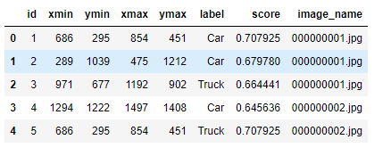
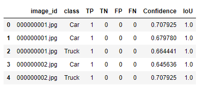
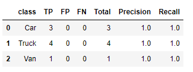
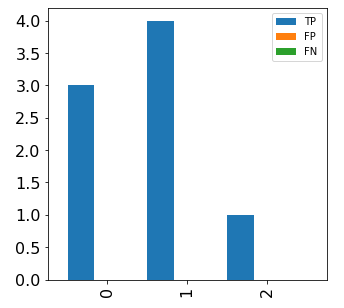
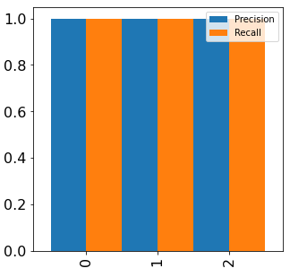
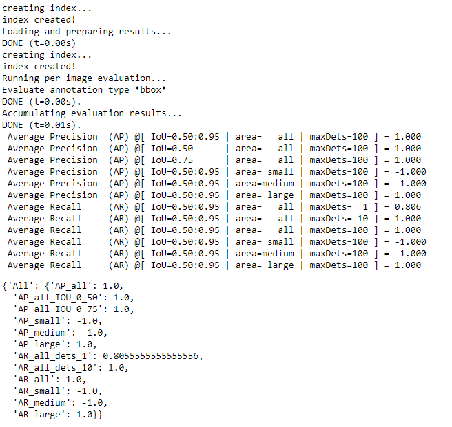

# Object Detection Metrics and Analysis in Python

Creating evaluation metrics for projects involving object detection takes a surprising amount of time. This repo contains code we've found useful to speed up the results analysis for object detection projects. It provides:

1. Easy creation of a pandas inference dataframe enabling detailed analysis.
2. Summary statistics for easy plotting.
3. Calculation of coco metrics using the same pandas dataframe. (uses pycocotools).

To see a quick example of the functionality have a look at the [starter notebook](./nbs/object-detection-metrics.ipynb).

## Installation

    pip install git+https://github.com/alexhock/object-detection-metrics

    from objdetecteval.metrics import (
        image_metrics as im,
        coco_metrics as cm
    )

Or

    Clone and copy the objdetect folder to your project.

## Example usage

Take predictions in a pandas dataframe and similar labels dataframe (same columns except for score) and calculate an 'inference' dataframe:

    infer_df = im.get_inference_metrics_from_df(preds_df, labels_df)
    infer_df.head()

The inference dataframe enables easy analysis of the results for example:
1. IoU stats by class and failure category
2. Highest scoring false positive predictions
3. Comparison of bounding box distributions for FP and TP
4. ... etc. ..

    class_summary_df = im.summarise_inference_metrics(infer_df)
    class_summary_df

This makes it easy to plot:

    figsize = (5, 5)
    fontsize = 16
    class_stats = class_summary_df.set_index("class")

    fig_confusion = (
        class_summary_df[["TP", "FP", "FN"]]
        .plot(kind="bar", figsize=figsize, width=1, align="center", fontsize=fontsize)
        .get_figure()
    )

    fig_pr = (
        class_summary_df[["Precision", "Recall"]]
        .plot(kind="bar", figsize=figsize, width=1, align="center", fontsize=fontsize)
        .get_figure()
    )

## Coco metrics are just as simple

Use the dataframes to calculate full coco metrics

    res = cm.get_coco_from_dfs(preds_df, labels_df, False)
    res

